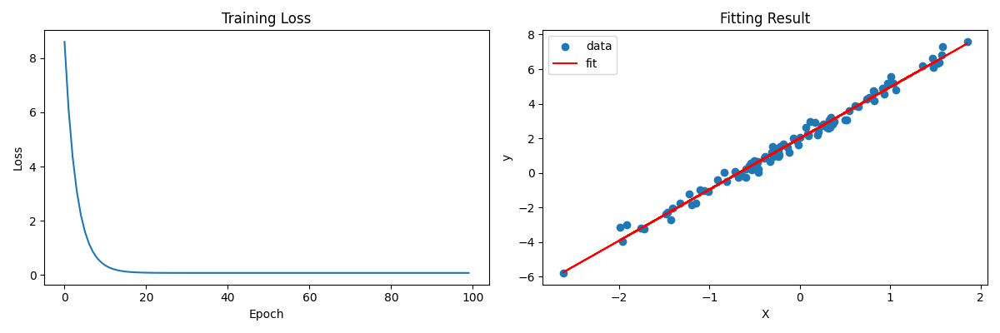
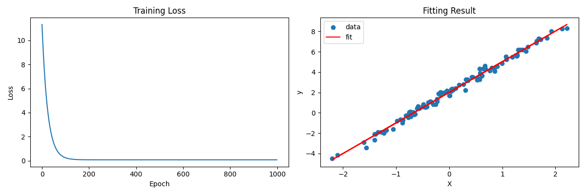
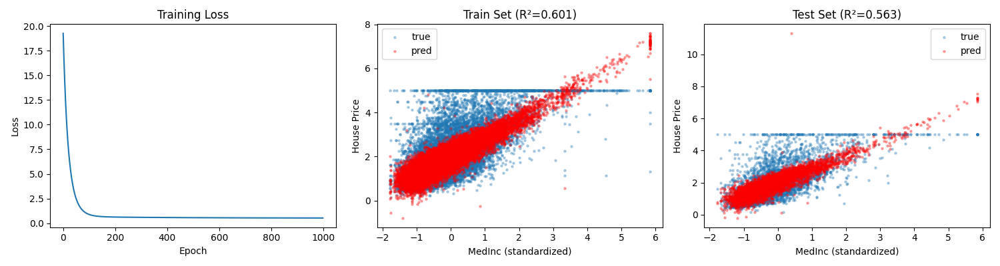

# 01 - Linear Regression

[中文版](README_CN.md)

## Objective

Learn the parameters of linear function `y = Wx + b`, where:
- `W` (weight) = 3
- `b` (bias) = 2

## Core Principles

### 1. Model

Linear regression is the simplest neural network with only one linear transformation:

```
y_pred = X @ W + b
```

### 2. Loss Function - Mean Squared Error (MSE)

Measures the difference between predicted and true values:

```
L = mean((y_pred - y_true)²)
```

### 3. Gradient Descent

Update parameters in the opposite direction of the gradient:

```
W = W - lr * ∂L/∂W
b = b - lr * ∂L/∂b
```

### 4. Gradient Derivation (Manual Implementation in Numpy)

For MSE loss `L = (1/n) * Σ(y_pred - y_true)²`:

```python
dL/dy_pred = 2 * (y_pred - y_true) / n   # gradient of loss w.r.t. prediction
dL/dW = X.T @ dL/dy_pred                  # chain rule
dL/db = sum(dL/dy_pred)                   # chain rule
```

## Implementations

| File | Method | Features |
|------|--------|----------|
| `linear_regression_numpy.py` | Manual gradient | Understand underlying principles |
| `linear_regression_torch.py` | PyTorch autograd | Use `loss.backward()` for automatic computation |
| `linear_regression_california_housing.py` | Real dataset | Multi-feature regression with train/test split |

## Training Results - Synthetic Data

After training, the model learns parameters close to true values:
- Learned W ≈ 3.0
- Learned b ≈ 2.0

### Numpy Version


### PyTorch Version


## Key Code Comparison

### Numpy - Manual Gradient
```python
# Forward pass
y_pred = X @ W + b
loss = ((y_pred - y_true) ** 2).mean()

# Manual gradient computation
dL_dy = 2 * (y_pred - y_true) / n
dL_dW = X.T @ dL_dy
dL_db = dL_dy.sum()

# Update parameters
W -= lr * dL_dW
b -= lr * dL_db
```

### PyTorch - Automatic Differentiation
```python
# Forward pass
y_pred = X @ W + b
loss = ((y_pred - y_true)**2).mean()

# Automatic gradient computation
loss.backward()

# Update parameters
with torch.no_grad():
    W -= lr * W.grad
    b -= lr * b.grad
```

---

## Real Dataset - California Housing

Apply linear regression to a real dataset with 8 features to predict house prices.

### Dataset Info

- **Samples**: 20,640
- **Features**: 8 (MedInc, HouseAge, AveRooms, AveBedrms, Population, AveOccup, Latitude, Longitude)
- **Target**: Median house value (in $100,000)

### Key Differences from Synthetic Data

| Aspect | Synthetic | California Housing |
|--------|-----------|-------------------|
| Features | 1 | 8 |
| Data split | None | 80% train / 20% test |
| Preprocessing | None | StandardScaler |
| Evaluation | Loss only | MSE, RMSE, MAE, R² |

### Evaluation Metrics

| Metric | Description |
|--------|-------------|
| **MSE** | Mean Squared Error - average of squared differences |
| **RMSE** | Root MSE - in same unit as target |
| **MAE** | Mean Absolute Error - average of absolute differences |
| **R²** | Coefficient of determination - proportion of variance explained (1.0 = perfect) |

### Training Results



- **Left**: Training loss curve
- **Middle**: Train set predictions (showing MedInc feature)
- **Right**: Test set predictions with R² score

### Result Analysis

**R² Comparison**

| Model | Train R² | Test R² |
|-------|----------|---------|
| Single feature (MedInc) | 0.601 | 0.563 |
| 8 features | 0.608 | 0.576 |

**Feature Weight Interpretation**

```
Positive correlation (higher = more expensive):
  MedInc:    0.8616  ← Income is most important
  AveBedrms: 0.2884
  HouseAge:  0.1499

Negative correlation (higher = cheaper):
  Latitude: -0.6822  ← Further north = cheaper
  Longitude:-0.6537  ← Further east = cheaper (inland CA)
  AveRooms: -0.2606  ← Possible multicollinearity with AveBedrms
```

**Intuitive**: Coastal California (west, south) is more expensive; higher income areas have higher prices.

### Conclusion

Linear regression hits a ceiling of approximately **R² ≈ 0.6** on this dataset. To improve further:

1. **Non-linear models** - MLP, Decision Trees, XGBoost
2. **Feature engineering** - Cross features, polynomial features

This is exactly what the next step (MLP) will address!
