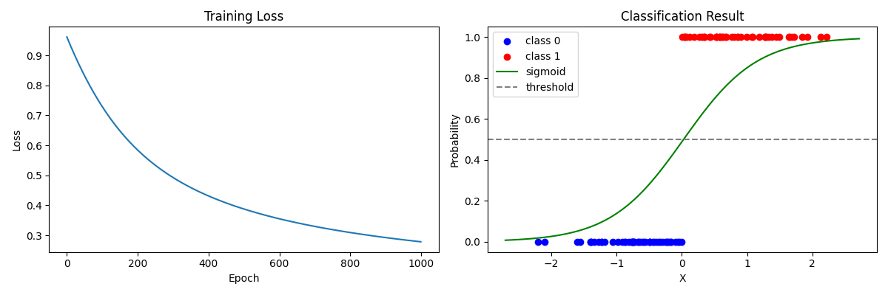

# 02 - 逻辑回归 (Logistic Regression)

[English](README.md)

## 目标

实现二分类：判断 `x > 0` 是否成立
- 输入：随机数 x
- 输出：0 或 1

## 核心原理

### 1. 与线性回归的区别

| | 线性回归 | 逻辑回归 |
|---|---|---|
| 任务 | 回归（预测连续值） | 分类（预测类别） |
| 输出 | 任意实数 | 0~1 的概率 |
| 激活函数 | 无 | Sigmoid |
| 损失函数 | MSE | 交叉熵 |

### 2. 模型结构

```
t = X @ W + b              # 线性变换
y_pred = sigmoid(t)        # 映射到 (0, 1) 概率
```

### 3. Sigmoid 函数

将任意实数映射到 (0, 1) 区间，表示概率：

```python
sigmoid(t) = 1 / (1 + exp(-t))
```

特性：
- t → +∞ 时，sigmoid → 1
- t → -∞ 时，sigmoid → 0
- t = 0 时，sigmoid = 0.5

### 4. 损失函数 - 二元交叉熵 (Binary Cross-Entropy)

```python
L = -mean(y_true * log(y_pred) + (1 - y_true) * log(1 - y_pred))
```

直观理解：
- 当 `y_true = 1` 时，希望 `y_pred` 接近 1，`log(y_pred)` 越大损失越小
- 当 `y_true = 0` 时，希望 `y_pred` 接近 0，`log(1 - y_pred)` 越大损失越小

### 5. 分类决策

```python
预测类别 = 1 if y_pred > 0.5 else 0
```

## 训练流程

```python
for epoch in range(epoch_count):
    # 1. 前向传播
    t = X @ W + b
    y_pred = 1 / (1 + torch.exp(-t))  # sigmoid

    # 2. 计算损失（交叉熵）
    loss = -(y_true * torch.log(y_pred) + (1 - y_true) * torch.log(1 - y_pred)).mean()

    # 3. 反向传播
    loss.backward()

    # 4. 更新参数
    W -= lr * W.grad
    b -= lr * b.grad
```

## 训练结果

模型能够学会判断 x 的正负：



- **左图**：损失曲线，随训练下降
- **右图**：分类结果，蓝色=类别0，红色=类别1，绿色曲线=决策边界（sigmoid）

## 从线性回归到逻辑回归

只需要两个改动：

1. **加上 Sigmoid**：`y_pred = sigmoid(X @ W + b)`
2. **换损失函数**：MSE → Cross-Entropy

这就是神经网络的基本模式：线性变换 + 非线性激活 + 合适的损失函数
