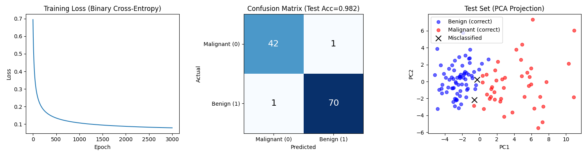

# 02 - 逻辑回归 (Logistic Regression)

[English](README.md)

## 目标

实现二分类：判断 `x > 0` 是否成立
- 输入：随机数 x
- 输出：0 或 1

## 核心原理

### 1. 与线性回归的区别

| | 线性回归 | 逻辑回归 |
|---|---|---|
| 任务 | 回归（预测连续值） | 分类（预测类别） |
| 输出 | 任意实数 | 0~1 的概率 |
| 激活函数 | 无 | Sigmoid |
| 损失函数 | MSE | 交叉熵 |

### 2. 模型结构

```
t = X @ W + b              # 线性变换
y_pred = sigmoid(t)        # 映射到 (0, 1) 概率
```

### 3. Sigmoid 函数

将任意实数映射到 (0, 1) 区间，表示概率：

```python
sigmoid(t) = 1 / (1 + exp(-t))
```

特性：
- t → +∞ 时，sigmoid → 1
- t → -∞ 时，sigmoid → 0
- t = 0 时，sigmoid = 0.5

### 4. 损失函数 - 二元交叉熵 (Binary Cross-Entropy)

```python
L = -mean(y_true * log(y_pred) + (1 - y_true) * log(1 - y_pred))
```

直观理解：
- 当 `y_true = 1` 时，希望 `y_pred` 接近 1，`log(y_pred)` 越大损失越小
- 当 `y_true = 0` 时，希望 `y_pred` 接近 0，`log(1 - y_pred)` 越大损失越小

### 5. 分类决策

```python
预测类别 = 1 if y_pred > 0.5 else 0
```

## 实现版本

| 文件 | 方式 | 特点 |
|------|------|------|
| `logistic_regression_torch.py` | 合成数据 | 简单的 x > 0 分类 |
| `logistic_regression_breast_cancer.py` | 真实数据集 | 30 特征 + 训练/测试集划分 + 完整指标 |

## 训练流程

```python
for epoch in range(epoch_count):
    # 1. 前向传播
    t = X @ W + b
    y_pred = 1 / (1 + torch.exp(-t))  # sigmoid

    # 2. 计算损失（交叉熵）
    loss = -(y_true * torch.log(y_pred) + (1 - y_true) * torch.log(1 - y_pred)).mean()

    # 3. 反向传播
    loss.backward()

    # 4. 更新参数
    W -= lr * W.grad
    b -= lr * b.grad
```

## 训练结果 - 合成数据

模型能够学会判断 x 的正负：


- **左图**：损失曲线，随训练下降
- **右图**：分类结果，蓝色=类别0，红色=类别1，绿色曲线=决策边界（sigmoid）

## 从线性回归到逻辑回归

只需要两个改动：

1. **加上 Sigmoid**：`y_pred = sigmoid(X @ W + b)`
2. **换损失函数**：MSE → Cross-Entropy

这就是神经网络的基本模式：线性变换 + 非线性激活 + 合适的损失函数

---

## 真实数据集 - Breast Cancer Wisconsin

使用乳腺癌数据集进行肿瘤分类。

### 数据集信息

- **样本数**: 569
- **特征数**: 30 个 (半径、纹理、周长、面积、平滑度等)
- **目标**: 恶性 (0) 或 良性 (1)
- **类别分布**: ~63% 良性, ~37% 恶性

### 与合成数据的区别

| 方面 | 合成数据 | Breast Cancer |
|------|----------|---------------|
| 特征数 | 1 | 30 |
| 数据划分 | 无 | 80% 训练 / 20% 测试 |
| 预处理 | 无 | StandardScaler 标准化 |
| 评估指标 | 仅准确率 | Accuracy, Precision, Recall, F1 |

### 分类评估指标

| 指标 | 说明 |
|------|------|
| **Accuracy** | 准确率 - 正确预测数 / 总数 |
| **Precision** | 精确率 - TP / (TP + FP)，"预测为正的样本中有多少是对的？" |
| **Recall** | 召回率 - TP / (TP + FN)，"实际为正的样本中找到了多少？" |
| **F1** | F1分数 - Precision 和 Recall 的调和平均 |

### 训练结果



- **左图**: 训练损失曲线 (二元交叉熵)
- **中图**: 混淆矩阵，展示 TP, TN, FP, FN
- **右图**: PCA 降维后的测试集可视化 (黑色 × = 错分样本)

### 结果分析

**性能指标**

| 指标 | 训练集 | 测试集 |
|------|--------|--------|
| Accuracy | 0.989 | 0.974 |
| Precision | 0.993 | 0.986 |
| Recall | 0.989 | 0.972 |
| F1 | 0.991 | 0.979 |

**关键发现**

- 逻辑回归在该数据集上达到 **97%+ 准确率**
- 错分样本很少 (114 个测试样本中仅 3 个错误)
- 线性决策边界效果很好，因为标准化后特征分离度高

### 结论

逻辑回归在 Breast Cancer 数据集上表现优异 (**~97% 准确率**)，说明：

1. **线性模型可以很强大** - 当特征本身具有很强的区分度时
2. **特征缩放很重要** - StandardScaler 帮助很大
3. **医学诊断场景** 更关注 Recall（不能漏诊癌症病例）
