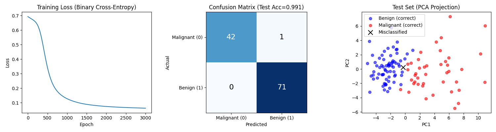
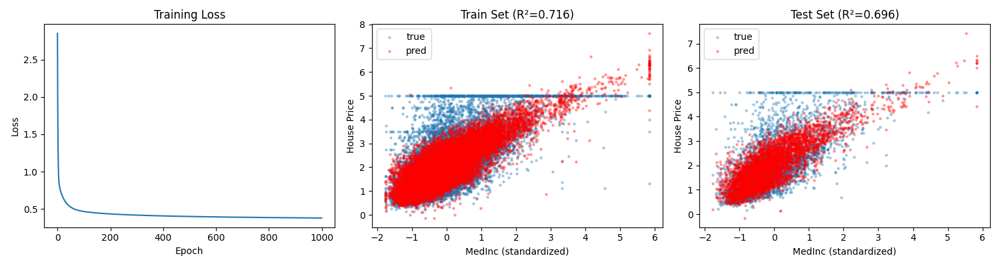

# 03 - Multi-Layer Perceptron (MLP)

[中文版](README_CN.md)

## Objective

Implement multi-layer neural networks with hidden layers and nonlinear activation functions.

## Core Principles

### 1. From Logistic Regression to MLP

| | Logistic Regression | MLP |
|---|---|---|
| Structure | Single layer | Multiple layers |
| Expressiveness | Linear decision boundary | Nonlinear decision boundary |
| Activation | Sigmoid (output only) | ReLU (hidden) + Sigmoid (output) |
| Parameters | W, b | W1, b1, W2, b2, ... |

### 2. Model Structure

```
Input → Hidden Layer → Output Layer → Prediction
  X   →  ReLU(X@W1+b1) → Sigmoid(H@W2+b2) → y_pred
```

Two-layer MLP (one hidden layer):
```python
def forward(X):
    h = relu(X @ W1 + b1)      # Hidden layer with ReLU
    return sigmoid(h @ W2 + b2) # Output layer with Sigmoid
```

### 3. Activation Functions

**ReLU (Rectified Linear Unit)**
```python
relu(t) = max(0, t)
```
- Simple and efficient
- Mitigates vanishing gradient problem
- Commonly used in hidden layers

**Sigmoid**
```python
sigmoid(t) = 1 / (1 + exp(-t))
```
- Maps to (0, 1) probability
- Used in output layer for binary classification

### 4. Why Hidden Layers Matter

- **Universal Approximation**: MLP with one hidden layer can approximate any continuous function
- **Feature Learning**: Hidden layers learn intermediate representations
- **Nonlinear Boundaries**: Can separate data that isn't linearly separable

### 5. Backpropagation

The chain rule propagates gradients through all layers:

```
∂Loss/∂W1 = ∂Loss/∂y_pred × ∂y_pred/∂h × ∂h/∂W1
```

PyTorch's autograd handles this automatically with `loss.backward()`.

## Implementations

| File | Dataset | Description |
|------|---------|-------------|
| `mlp_classification_breast_cancer.py` | Breast Cancer | Binary classification with 30→32→1 architecture |
| `mlp_regression_california_housing.py` | California Housing | Regression with 8→32→1 architecture |
| `mlp_iris.py` | Iris | Multi-class classification (TODO) |

## Training Loop

```python
for epoch in range(epoch_count):
    # 1. Forward pass (two layers)
    h = relu(X @ W1 + b1)
    y_pred = sigmoid(h @ W2 + b2)

    # 2. Compute loss (cross-entropy)
    loss = -(y_true * log(y_pred) + (1 - y_true) * log(1 - y_pred)).mean()

    # 3. Backward pass
    loss.backward()

    # 4. Update all parameters
    W1 -= lr * W1.grad
    b1 -= lr * b1.grad
    W2 -= lr * W2.grad
    b2 -= lr * b2.grad
```

---

## Breast Cancer Classification Results

### Network Architecture

```
Input (30 features) → Hidden (32 units, ReLU) → Output (1 unit, Sigmoid)
```

- Hidden size: 32
- Learning rate: 0.01
- Epochs: 3000

### MLP vs Logistic Regression

| Metric | Logistic Regression | MLP |
|--------|---------------------|-----|
| Test Accuracy | 98.25% | **99.12%** ↑ |
| Test F1 | 98.59% | **99.30%** ↑ |
| Misclassified | 2 | **1** |

### Training Results



- **Left**: Training loss curve (Binary Cross-Entropy)
- **Middle**: Confusion matrix showing TP, TN, FP, FN
- **Right**: PCA projection of test set (black × = misclassified)

### Key Findings

- **100% Recall**: No false negatives - all cancer cases detected
- **Only 1 error**: Single false positive (FP=1)
- **Improvement over logistic regression**: Hidden layer helps capture nonlinear patterns

### Why MLP Outperforms

1. **Nonlinear decision boundary**: Can fit more complex patterns
2. **Feature transformation**: Hidden layer learns useful intermediate features
3. **Better generalization**: More expressive model captures subtle distinctions

---

## California Housing Regression Results

### Network Architecture

```
Input (8 features) → Hidden (32 units, ReLU) → Output (1 unit, Linear)
```

- Hidden size: 32
- Learning rate: 0.01
- Epochs: 1000

### MLP vs Linear Regression

| Metric | Linear Regression | MLP |
|--------|-------------------|-----|
| Test R² | 0.577 | **0.694** ↑ |
| Test RMSE | 0.744 | **0.633** ↓ |

**+12 percentage points improvement** - confirms nonlinear relationships in housing prices.

### Training Results



- **Left**: Training loss curve (MSE)
- **Middle**: Train set predictions (MedInc feature)
- **Right**: Test set predictions with R² score

### Key Observations

- **Fast convergence**: Loss stabilizes after ~100 epochs
- **No overfitting**: Train R² (0.714) ≈ Test R² (0.694)
- **Better fit**: Predicted points (red) closer to actual values (blue)

### Why MLP Outperforms Linear Regression

1. **Captures nonlinearity**: House prices don't scale linearly with features
2. **Feature interactions**: Hidden layer learns combinations of input features
3. **Better boundaries**: Can model complex price regions in feature space

---

## Conclusion

MLP consistently outperforms single-layer models on both tasks:

| Task | Single-Layer | MLP | Improvement |
|------|--------------|-----|-------------|
| Classification (Breast Cancer) | 98.25% acc | **99.12%** acc | +0.87% |
| Regression (California Housing) | R² 0.577 | **R² 0.694** | +12% |

Key takeaways:

1. **Hidden layers add power** - even one hidden layer significantly improves performance
2. **ReLU activation** enables efficient training
3. **Universal approximation** - MLP can fit complex nonlinear patterns
4. **Trade-off**: More parameters but still fast to train on small-medium datasets
