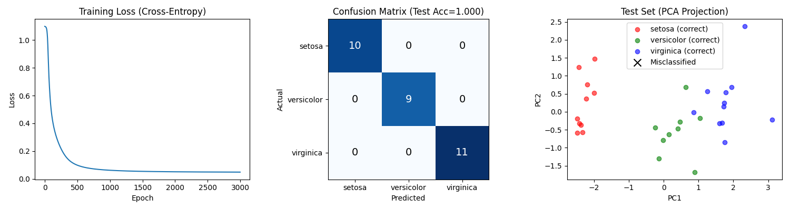

# 03 - 多层感知机 (MLP)

[English](README.md)

## 目标

实现多层神经网络，包含隐藏层和非线性激活函数。

## 核心原理

### 1. 从逻辑回归到 MLP

| | 逻辑回归 | MLP |
|---|---|---|
| 结构 | 单层 | 多层 |
| 表达能力 | 线性决策边界 | 非线性决策边界 |
| 激活函数 | Sigmoid（仅输出） | ReLU（隐藏层）+ Sigmoid/Softmax（输出层） |
| 参数 | W, b | W1, b1, W2, b2, ... |

### 2. 模型结构

**二分类：**
```
输入 → 隐藏层 → 输出层 → 预测
  X  → ReLU(X@W1+b1) → Sigmoid(H@W2+b2) → y_pred (0~1)
```

**多分类：**
```
输入 → 隐藏层 → 输出层 → 预测
  X  → ReLU(X@W1+b1) → Softmax(H@W2+b2) → y_pred (概率分布)
```

两层 MLP：
```python
def forward(X):
    h = relu(X @ W1 + b1)       # 隐藏层 + ReLU
    return softmax(h @ W2 + b2) # 输出层 + Softmax（多分类）
    # 或 sigmoid(...) 用于二分类
```

### 3. 激活函数

**ReLU（线性整流单元）**
```python
relu(t) = max(0, t)
```
- 简单高效
- 缓解梯度消失问题
- 隐藏层常用激活函数

**Sigmoid**
```python
sigmoid(t) = 1 / (1 + exp(-t))
```
- 映射到 (0, 1) 概率
- 二分类输出层使用

**Softmax**
```python
softmax(t) = exp(t) / sum(exp(t))
```
- 映射到概率分布（总和 = 1）
- 多分类输出层使用

### 4. 隐藏层的作用

- **万能近似**：一个隐藏层的 MLP 可以逼近任意连续函数
- **特征学习**：隐藏层学习中间表示
- **非线性边界**：可以分离线性不可分的数据

### 5. 反向传播

链式法则将梯度传播到所有层：

```
∂Loss/∂W1 = ∂Loss/∂y_pred × ∂y_pred/∂h × ∂h/∂W1
```

PyTorch 的 autograd 通过 `loss.backward()` 自动完成。

## 实现版本

| 文件 | 数据集 | 说明 |
|------|--------|------|
| `mlp_classification_breast_cancer.py` | Breast Cancer | 30→32→1 架构的二分类 |
| `mlp_regression_california_housing.py` | California Housing | 8→32→32→1 架构的回归 |
| `mlp_iris.py` | Iris | 4→32→3 架构的多分类 |

## 训练流程

**二分类：**
```python
for epoch in range(epoch_count):
    # 1. 前向传播
    h = relu(X @ W1 + b1)
    y_pred = sigmoid(h @ W2 + b2)

    # 2. 二元交叉熵损失
    loss = -(y_true * log(y_pred) + (1 - y_true) * log(1 - y_pred)).mean()

    # 3. 反向传播 & 更新
    loss.backward()
    W1 -= lr * W1.grad; W2 -= lr * W2.grad
```

**多分类：**
```python
for epoch in range(epoch_count):
    # 1. 前向传播 + softmax
    h = relu(X @ W1 + b1)
    y_pred = softmax(h @ W2 + b2)  # 输出: (n, num_classes)

    # 2. 多分类交叉熵损失
    y_onehot = one_hot(y_true, num_classes)
    loss = -(y_onehot * log(y_pred)).sum(dim=1).mean()

    # 3. 反向传播 & 更新
    loss.backward()
    W1 -= lr * W1.grad; W2 -= lr * W2.grad
```

---

## 乳腺癌分类结果

### 网络架构

```
输入 (30 特征) → 隐藏层 (32 单元, ReLU) → 输出层 (1 单元, Sigmoid)
```

- 隐藏层大小：32
- 学习率：0.01
- 训练轮数：3000

### MLP vs 逻辑回归

| 指标 | 逻辑回归 | MLP |
|------|----------|-----|
| 测试准确率 | 98.25% | **99.12%** ↑ |
| 测试 F1 | 98.59% | **99.30%** ↑ |
| 错误样本 | 2 个 | **1 个** |

### 训练结果


- **左图**：训练损失曲线（二元交叉熵）
- **中图**：混淆矩阵，展示 TP, TN, FP, FN
- **右图**：PCA 降维后的测试集可视化（黑色 × = 错分样本）

### 关键发现

- **Recall = 100%**：无假阴性 - 所有癌症病例都被检出
- **仅 1 个错误**：只有 1 个假阳性（FP=1）
- **相比逻辑回归有提升**：隐藏层帮助捕获非线性模式

### 为什么 MLP 更好？

1. **非线性决策边界**：可以拟合更复杂的模式
2. **特征变换**：隐藏层学习有用的中间特征
3. **更好的泛化**：更强的表达能力捕获细微差别

---

## California Housing 回归结果

### 网络架构

```
输入 (8 特征) → 隐藏层1 (32 单元, ReLU) → 隐藏层2 (32 单元, ReLU) → 输出层 (1 单元, 线性)
```

- 隐藏层：2 × 32 单元
- 学习率：0.01
- 训练轮数：1000

### MLP vs 线性回归

| 指标 | 线性回归 | MLP (2 隐藏层) |
|------|----------|-----|
| Test R² | 0.577 | **0.717** ↑ |
| Test RMSE | 0.744 | **0.609** ↓ |

提升了约 **14 个百分点**，说明房价和特征之间确实存在非线性关系。

### 训练结果


- **左图**：训练损失曲线（MSE）
- **中图**：训练集预测效果（MedInc 特征）
- **右图**：测试集预测效果及 R² 分数

### 关键观察

- **快速收敛**：约 100 轮后 Loss 就基本稳定
- **无过拟合**：Train R² (0.741) ≈ Test R² (0.717)
- **拟合更好**：预测点（红）更贴近真实点（蓝）

### MLP 为什么更好？

1. **捕获非线性**：房价与特征之间不是简单的线性关系
2. **特征交互**：隐藏层学习输入特征的组合
3. **更好的边界**：可以在特征空间中建模复杂的价格区域

---

## Iris 多分类结果

### 网络架构

```
输入 (4 特征) → 隐藏层 (32 单元, ReLU) → 输出层 (3 单元, Softmax)
```

- 隐藏层大小：32
- 学习率：0.1
- 训练轮数：3000

### 与二分类的关键区别

| 方面 | 二分类（乳腺癌） | 多分类（Iris） |
|------|------------------|----------------|
| 输出层 | 1 单元 + Sigmoid | 3 单元 + Softmax |
| 输出形状 | (n, 1) | (n, 3) |
| 标签格式 | 0/1 浮点数 | 0/1/2 整数（或 one-hot） |
| 损失函数 | 二元交叉熵 | 多分类交叉熵 |
| 预测方式 | `y_pred > 0.5` | `y_pred.argmax(dim=1)` |

### Softmax 函数

```python
def softmax(t):
    exp_t = torch.exp(t - t.max(dim=1, keepdim=True).values)  # 数值稳定性
    return exp_t / exp_t.sum(dim=1, keepdim=True)
```

将输出映射为所有类别的概率分布（总和 = 1）。

### 多分类交叉熵损失

```python
# 将标签转为 one-hot 编码
y_onehot = (y.unsqueeze(1) == torch.arange(num_classes)).float()

# 交叉熵: -sum(y_onehot * log(y_pred)) / n
loss = -(y_onehot * torch.log(y_pred + 1e-8)).sum(dim=1).mean()
```

### 训练结果



- **左图**：训练损失曲线（交叉熵）
- **中图**：混淆矩阵（3×3），展示 setosa、versicolor、virginica 的预测情况
- **右图**：PCA 降维后的测试集可视化，3 种颜色对应 3 个类别

### 关键观察

- **训练集准确率**：98.33%（118/120）
- **测试集准确率**：100%（30/30）
- **清晰分离**：Setosa 完美分类（线性可分）
- **快速收敛**：前 200 轮 Loss 快速下降，之后趋于稳定

---

## 结论

MLP 在所有任务上都明显超过单层模型：

| 任务 | 单层模型 | MLP | 提升 |
|------|----------|-----|------|
| 二分类（Breast Cancer） | 98.25% acc | **99.12%** acc | +0.87% |
| 多分类（Iris） | - | **98-100%** acc | Softmax + CE |
| 回归（California Housing） | R² 0.577 | **R² 0.717** | +14% |

关键收获：

1. **隐藏层增强能力** - 即使一个隐藏层也能显著提升性能
2. **ReLU 激活** 使训练更高效
3. **万能近似** - MLP 可以拟合复杂的非线性模式
4. **Softmax 用于多分类** - 将二分类扩展到 N 个类别
5. **权衡**：参数更多，但在中小数据集上训练仍然很快
