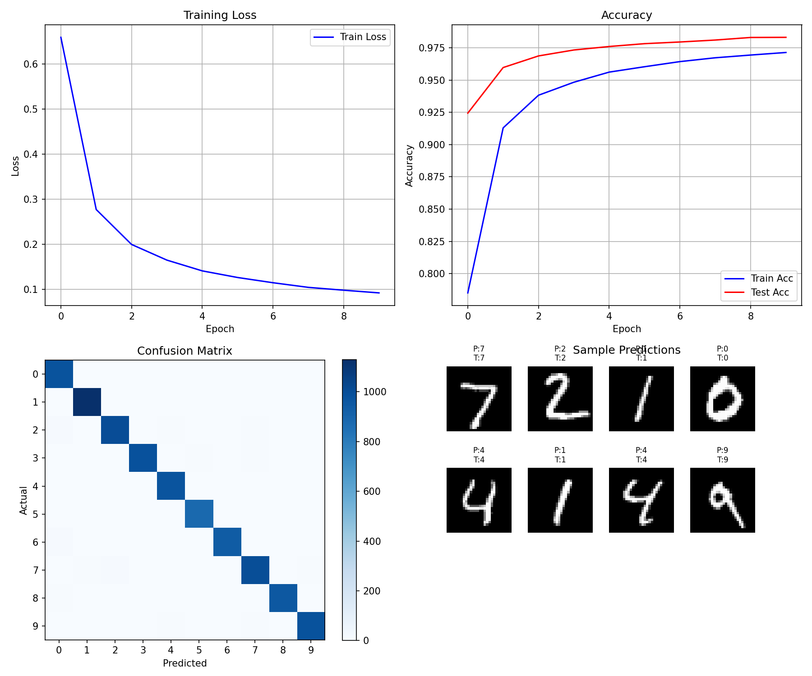
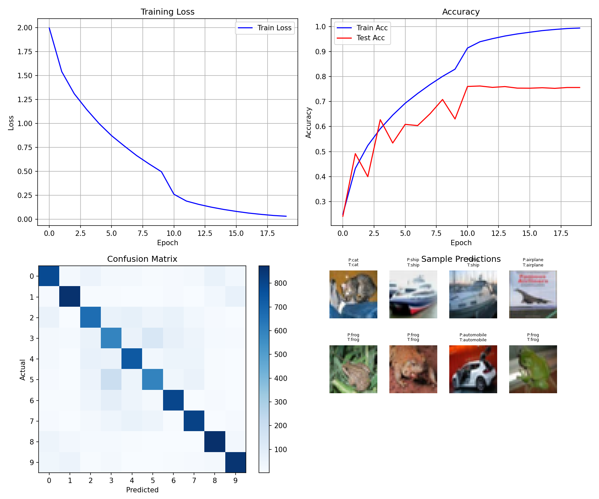

# 04 - Convolutional Neural Network (CNN)

From MLP to CNN - adding spatial awareness for image recognition.

## What's New?

| Aspect | MLP | CNN |
|--------|-----|-----|
| Input format | Flattened 1D (784,) | Keep 2D (28, 28) |
| Connectivity | Fully connected | Local connections |
| Parameters | 784×128 = 100K+ | 8×3×3 = 72 (conv layer) |
| Key idea | Global patterns | Local features + weight sharing |

## Network Architecture (MNIST)

```
Input (batch, 28, 28)
    ↓
Conv2D: 32 filters of 3×3 → (batch, 32, 26, 26) → ReLU
    ↓
Conv2D: 64 filters of 3×3 → (batch, 64, 24, 24) → ReLU
    ↓
MaxPool 2×2 → (batch, 64, 12, 12)
    ↓
Dropout 0.25
    ↓
Flatten → (batch, 9216)
    ↓
Dense: 9216 → 128 → ReLU → Dropout 0.25
    ↓
Dense: 128 → 10 → Softmax
    ↓
Output: probabilities for 10 classes
```

## Dimension Changes

| Layer | Output Shape | Calculation |
|-------|--------------|-------------|
| Input | (batch, 28, 28) | — |
| Conv1 | (batch, 32, 26, 26) | 28-3+1=26 |
| Conv2 | (batch, 64, 24, 24) | 26-3+1=24 |
| MaxPool | (batch, 64, 12, 12) | 24/2=12 |
| Flatten | (batch, 9216) | 64×12×12 |
| Dense1 | (batch, 128) | — |
| Dense2 | (batch, 10) | 10 classes |

## Core Components

### 1. Convolution (Conv2D)

```python
def conv2d(X, W, b):
    # X: (batch, H, W) input image
    # W: (out_c, kH, kW) filters
    # b: (out_c,) bias

    for oc in range(out_channel):   # each filter
        for i in range(out_H):      # slide vertically
            for j in range(out_W):  # slide horizontally
                region = X[:, i:i+kH, j:j+kW]
                output[:, oc, i, j] = (region * W[oc]).sum(dim=(1,2)) + b[oc]
```

**Purpose**: Extract local features (edges, textures, etc.)

### 2. Pooling (MaxPool)

```python
def maxpool2d(X, size=2):
    # Take max value from each 2×2 region
    for i in range(out_H):
        for j in range(out_W):
            region = X[:, :, i*size:(i+1)*size, j*size:(j+1)*size]
            output[:, :, i, j] = region.max()
```

**Purpose**: Reduce dimensions, retain key features

### 3. Flatten

```python
h = h.view(batch_size, -1)  # (batch, 8, 13, 13) → (batch, 1352)
```

**Purpose**: Connect conv layers to fully-connected layers

### 4. Softmax + Cross-Entropy

```python
def softmax(x):
    exp_x = torch.exp(x - x.max(dim=1, keepdim=True).values)
    return exp_x / exp_x.sum(dim=1, keepdim=True)

def cross_entropy(y_pred, y_true):
    return -torch.log(y_pred[range(batch), y_true] + 1e-8).mean()
```

**Purpose**: Multi-class output + loss computation

## Training Loop

```python
for epoch in range(epochs):
    for i in range(0, len(X_train), batch_size):
        X = X_train[i:i+batch_size]
        y = y_train[i:i+batch_size]

        # Forward
        h = conv2d(X, W1, b1)
        h = relu(h)
        h = maxpool2d(h)
        h = h.view(h.shape[0], -1)
        out = softmax(h @ W2 + b2)

        # Loss
        loss = cross_entropy(out, y)

        # Backward + Update
        loss.backward()
        # Update W1, b1, W2, b2...
```

## Parameter Initialization

```python
# Conv layer
W1 = (torch.randn(8, 3, 3) * 0.1).requires_grad_(True)
b1 = torch.zeros(8, requires_grad=True)

# Fully-connected layer
W2 = (torch.randn(1352, 10) * 0.1).requires_grad_(True)
b2 = torch.zeros(10, requires_grad=True)
```

## Why CNN for Images?

1. **Translation invariance**: Same filter detects feature anywhere in image
2. **Parameter efficiency**: Weight sharing drastically reduces parameters
3. **Hierarchical features**: Low-level (edges) → High-level (shapes)
4. **Spatial structure**: Preserves 2D relationships in image

## Files

| File | Dataset | Description |
|------|---------|-------------|
| `cnn_mnist.py` | MNIST | Handwritten digit classification (0-9), 98.3% accuracy |
| `vgg16_cifar10.py` | CIFAR-10 | Full VGG16 (16 layers), class-based implementation |
| `vgg16_cifar10_v2.py` | CIFAR-10 | VGG16 with data augmentation & regularization, 81.4% accuracy |

## VGG16 Architecture

VGG16 is a 16-layer deep convolutional network with a simple and uniform architecture:

```
Input (batch, 3, 32, 32)
    ↓
[Conv3-64] × 2 → MaxPool → (batch, 64, 16, 16)
    ↓
[Conv3-128] × 2 → MaxPool → (batch, 128, 8, 8)
    ↓
[Conv3-256] × 3 → MaxPool → (batch, 256, 4, 4)
    ↓
[Conv3-512] × 3 → MaxPool → (batch, 512, 2, 2)
    ↓
[Conv3-512] × 3 → MaxPool → (batch, 512, 1, 1)
    ↓
Flatten → FC → FC → FC → Softmax
    ↓
Output: 10 classes
```

**Key design principles**:
- All conv layers use 3×3 filters with stride 1, padding 1
- All pooling layers use 2×2 max pooling with stride 2
- Channel doubling after each pooling (64 → 128 → 256 → 512)
- ReLU activation after every conv layer
- Batch normalization after each conv layer (in our implementation)

## v2 Optimizations

The v2 implementation adds several techniques to combat overfitting:

### 1. Data Augmentation

```python
def random_horizontal_flip(X, p=0.5):
    """Randomly flip images horizontally"""
    mask = torch.rand(X.shape[0], device=X.device) < p
    X[mask] = X[mask].flip(dims=[3])
    return X

def random_crop(X, padding=4):
    """Random crop with padding"""
    X_padded = F.pad(X, [padding]*4, mode='reflect')
    # Random offset for each image
    # Crop back to original size
```

### 2. Reduced FC Layers

```python
# v1: 4096 neurons (causes overfitting)
self.fc1 = Dense(512, 4096, device)
self.fc2 = Dense(4096, 4096, device)

# v2: 512 neurons (15.2M vs 33M params)
self.fc1 = Dense(512, 512, device)
self.fc2 = Dense(512, 512, device)
```

### 3. L2 Regularization (Weight Decay)

```python
def update(self, lr, weight_decay=5e-4):
    for param in self.parameters():
        if param.grad is not None:
            # Gradient descent with L2 penalty
            param -= lr * (param.grad + weight_decay * param)
```

### 4. Best Parameter Checkpoint

```python
if test_acc > best_test_acc:
    best_test_acc = test_acc
    best_params = {name: p.clone() for name, p in model.named_parameters()}
    print(f"New best! Saving parameters...")
```

## Results

### MNIST (cnn_mnist.py)

| Epoch | Train Loss | Train Acc | Test Acc |
|-------|------------|-----------|----------|
| 0 | 0.6588 | 78.5% | 92.4% |
| 5 | 0.1263 | 96.0% | 97.8% |
| 9 | 0.0922 | 97.1% | **98.3%** |



### CIFAR-10 VGG16: v1 vs v2 Comparison

| Metric | v1 | v2 | Improvement |
|--------|----|----|-------------|
| Test Accuracy | 75.6% | **81.4%** | +5.8% |
| Train Accuracy | 99.4% | 82.8% | - |
| Overfitting Gap | 23.8% | **1.4%** | -22.4% |
| Parameters | ~33M | ~15.2M | -54% |
| Best Epoch | 19 | 40 | - |

### v1 Results (vgg16_cifar10.py)

| Epoch | Train Loss | Train Acc | Test Acc |
|-------|------------|-----------|----------|
| 0 | 1.9950 | 25.0% | 24.2% |
| 9 | 0.4949 | 83.0% | 63.0% |
| 19 | 0.0308 | 99.4% | **75.6%** |

**Issue**: Severe overfitting (train 99.4% vs test 75.6%)



### v2 Results (vgg16_cifar10_v2.py)

| Epoch | Train Loss | Train Acc | Test Acc |
|-------|------------|-----------|----------|
| 0 | 2.1858 | 17.9% | 17.7% |
| 20 | 0.4884 | 82.8% | 79.7% |
| 40 | 0.4803 | 82.8% | **81.4%** |
| 100 | 0.5060 | 82.1% | 80.8% |

**Success**: Overfitting eliminated, test accuracy improved by 5.8%
