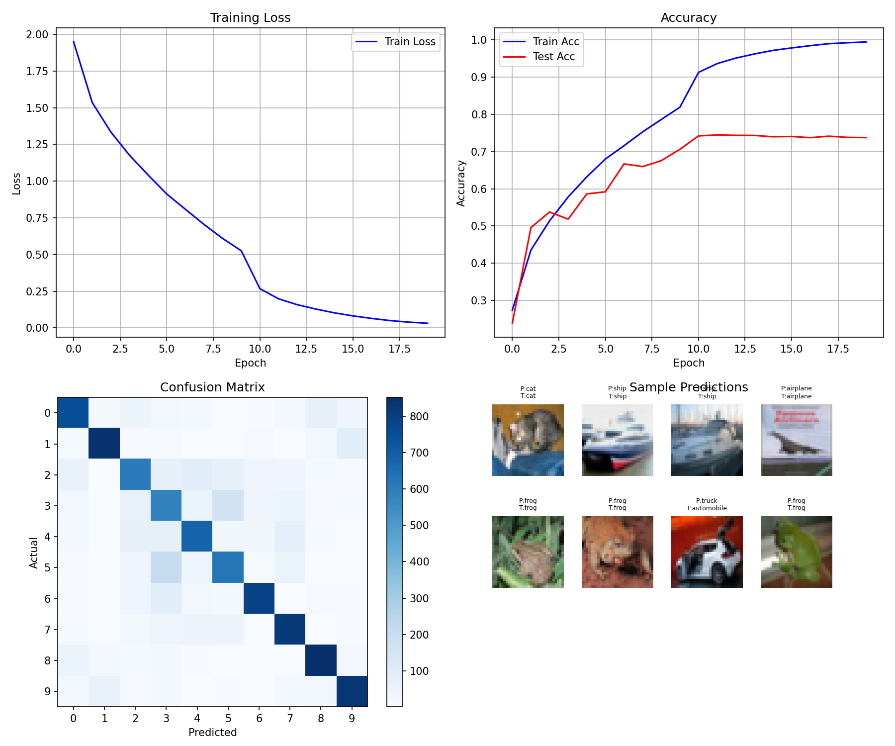

# 04 - 卷积神经网络 (CNN)

从 MLP 到 CNN —— 为图像识别添加空间感知能力。

## 有什么新内容？

| 方面 | MLP | CNN |
|------|-----|-----|
| 输入格式 | 展平成一维 (784,) | 保持二维 (28, 28) |
| 连接方式 | 全连接 | 局部连接 |
| 参数量 | 784×128 = 100K+ | 8×3×3 = 72（卷积层） |
| 核心思想 | 全局模式 | 局部特征 + 权重共享 |

## 网络结构 (MNIST)

```
输入 (batch, 28, 28)
    ↓
Conv2D: 32个3×3滤波器 → (batch, 32, 26, 26) → ReLU
    ↓
Conv2D: 64个3×3滤波器 → (batch, 64, 24, 24) → ReLU
    ↓
MaxPool 2×2 → (batch, 64, 12, 12)
    ↓
Dropout 0.25
    ↓
Flatten → (batch, 9216)
    ↓
Dense: 9216 → 128 → ReLU → Dropout 0.25
    ↓
Dense: 128 → 10 → Softmax
    ↓
输出: 10个类别的概率
```

## 尺寸变化

| 层 | 输出尺寸 | 计算 |
|---|---------|------|
| 输入 | (batch, 28, 28) | — |
| Conv1 | (batch, 32, 26, 26) | 28-3+1=26 |
| Conv2 | (batch, 64, 24, 24) | 26-3+1=24 |
| MaxPool | (batch, 64, 12, 12) | 24/2=12 |
| Flatten | (batch, 9216) | 64×12×12 |
| Dense1 | (batch, 128) | — |
| Dense2 | (batch, 10) | 10类 |

## 核心组件

### 1. 卷积 (Conv2D)

```python
def conv2d(X, W, b):
    # X: (batch, H, W) 输入图像
    # W: (out_c, kH, kW) 滤波器
    # b: (out_c,) 偏置

    for oc in range(out_channel):   # 每个滤波器
        for i in range(out_H):      # 垂直滑动
            for j in range(out_W):  # 水平滑动
                region = X[:, i:i+kH, j:j+kW]
                output[:, oc, i, j] = (region * W[oc]).sum(dim=(1,2)) + b[oc]
```

**作用**：提取局部特征（边缘、纹理等）

### 2. 池化 (MaxPool)

```python
def maxpool2d(X, size=2):
    # 每个 2×2 区域取最大值
    for i in range(out_H):
        for j in range(out_W):
            region = X[:, :, i*size:(i+1)*size, j*size:(j+1)*size]
            output[:, :, i, j] = region.max()
```

**作用**：降低尺寸，保留主要特征

### 3. 展平 (Flatten)

```python
h = h.view(batch_size, -1)  # (batch, 8, 13, 13) → (batch, 1352)
```

**作用**：连接卷积层和全连接层

### 4. Softmax + 交叉熵

```python
def softmax(x):
    exp_x = torch.exp(x - x.max(dim=1, keepdim=True).values)
    return exp_x / exp_x.sum(dim=1, keepdim=True)

def cross_entropy(y_pred, y_true):
    return -torch.log(y_pred[range(batch), y_true] + 1e-8).mean()
```

**作用**：多分类输出 + 损失计算

## 训练流程

```python
for epoch in range(epochs):
    for i in range(0, len(X_train), batch_size):
        X = X_train[i:i+batch_size]
        y = y_train[i:i+batch_size]

        # 前向
        h = conv2d(X, W1, b1)
        h = relu(h)
        h = maxpool2d(h)
        h = h.view(h.shape[0], -1)
        out = softmax(h @ W2 + b2)

        # 损失
        loss = cross_entropy(out, y)

        # 反向 + 更新
        loss.backward()
        # 更新 W1, b1, W2, b2...
```

## 参数初始化

```python
# 卷积层
W1 = (torch.randn(8, 3, 3) * 0.1).requires_grad_(True)
b1 = torch.zeros(8, requires_grad=True)

# 全连接层
W2 = (torch.randn(1352, 10) * 0.1).requires_grad_(True)
b2 = torch.zeros(10, requires_grad=True)
```

## 为什么用 CNN 处理图像？

1. **平移不变性**：同一滤波器可以检测图像任意位置的特征
2. **参数高效**：权重共享大幅减少参数量
3. **层次特征**：低级（边缘）→ 高级（形状）
4. **空间结构**：保留图像的二维关系

## 文件

| 文件 | 数据集 | 说明 |
|------|--------|------|
| `cnn_mnist.py` | MNIST | 手写数字分类 (0-9)，98.3% 准确率 |
| `vgg16_cifar10.py` | CIFAR-10 | 完整 VGG16 (16层)，类结构实现 |
| `vgg16_cifar10_v2.py` | CIFAR-10 | 带数据增强和正则化的 VGG16，81.4% 准确率 |

## VGG16 架构

VGG16 是一个 16 层深度卷积网络，具有简洁统一的架构：

```
输入 (batch, 3, 32, 32)
    ↓
[Conv3-64] × 2 → MaxPool → (batch, 64, 16, 16)
    ↓
[Conv3-128] × 2 → MaxPool → (batch, 128, 8, 8)
    ↓
[Conv3-256] × 3 → MaxPool → (batch, 256, 4, 4)
    ↓
[Conv3-512] × 3 → MaxPool → (batch, 512, 2, 2)
    ↓
[Conv3-512] × 3 → MaxPool → (batch, 512, 1, 1)
    ↓
Flatten → FC → FC → FC → Softmax
    ↓
输出: 10 个类别
```

**核心设计原则**：
- 所有卷积层使用 3×3 滤波器，步长 1，填充 1
- 所有池化层使用 2×2 最大池化，步长 2
- 每次池化后通道数翻倍 (64 → 128 → 256 → 512)
- 每个卷积层后使用 ReLU 激活
- 每个卷积层后使用批归一化（在我们的实现中）

## v2 优化

v2 版本添加了多项技术来对抗过拟合：

### 1. 数据增强

```python
def random_horizontal_flip(X, p=0.5):
    """随机水平翻转图像"""
    mask = torch.rand(X.shape[0], device=X.device) < p
    X[mask] = X[mask].flip(dims=[3])
    return X

def random_crop(X, padding=4):
    """带填充的随机裁剪"""
    X_padded = F.pad(X, [padding]*4, mode='reflect')
    # 为每张图像生成随机偏移
    # 裁剪回原始尺寸
```

### 2. 缩减全连接层

```python
# v1: 4096 神经元（导致过拟合）
self.fc1 = Dense(512, 4096, device)
self.fc2 = Dense(4096, 4096, device)

# v2: 512 神经元（15.2M vs 33M 参数）
self.fc1 = Dense(512, 512, device)
self.fc2 = Dense(512, 512, device)
```

### 3. L2 正则化（权重衰减）

```python
def update(self, lr, weight_decay=5e-4):
    for param in self.parameters():
        if param.grad is not None:
            # 带 L2 惩罚的梯度下降
            param -= lr * (param.grad + weight_decay * param)
```

### 4. 最佳参数检查点

```python
if test_acc > best_test_acc:
    best_test_acc = test_acc
    best_params = {name: p.clone() for name, p in model.named_parameters()}
    print(f"发现新最佳！保存参数...")
```

## 结果

### MNIST (cnn_mnist.py)

| Epoch | Train Loss | Train Acc | Test Acc |
|-------|------------|-----------|----------|
| 0 | 0.6588 | 78.5% | 92.4% |
| 5 | 0.1263 | 96.0% | 97.8% |
| 9 | 0.0922 | 97.1% | **98.3%** |


### CIFAR-10 VGG16: v1 与 v2 对比

| 指标 | v1 | v2 | 提升 |
|------|----|----|------|
| 测试准确率 | 75.6% | **81.4%** | +5.8% |
| 训练准确率 | 99.4% | 82.8% | - |
| 过拟合差距 | 23.8% | **1.4%** | -22.4% |
| 参数量 | ~33M | ~15.2M | -54% |
| 最佳 Epoch | 19 | 40 | - |

### v1 结果 (vgg16_cifar10.py)

| Epoch | Train Loss | Train Acc | Test Acc |
|-------|------------|-----------|----------|
| 0 | 1.9950 | 25.0% | 24.2% |
| 9 | 0.4949 | 83.0% | 63.0% |
| 19 | 0.0308 | 99.4% | **75.6%** |

**问题**：严重过拟合（训练 99.4% vs 测试 75.6%）

### v2 结果 (vgg16_cifar10_v2.py)

| Epoch | Train Loss | Train Acc | Test Acc |
|-------|------------|-----------|----------|
| 0 | 2.1858 | 17.9% | 17.7% |
| 20 | 0.4884 | 82.8% | 79.7% |
| 40 | 0.4803 | 82.8% | **81.4%** |
| 100 | 0.5060 | 82.1% | 80.8% |

**成功**：消除过拟合，测试准确率提升 5.8%

### v1 与 v2 训练曲线对比

| v1（过拟合） | v2（正则化） |
|:---:|:---:|
|  |  |
